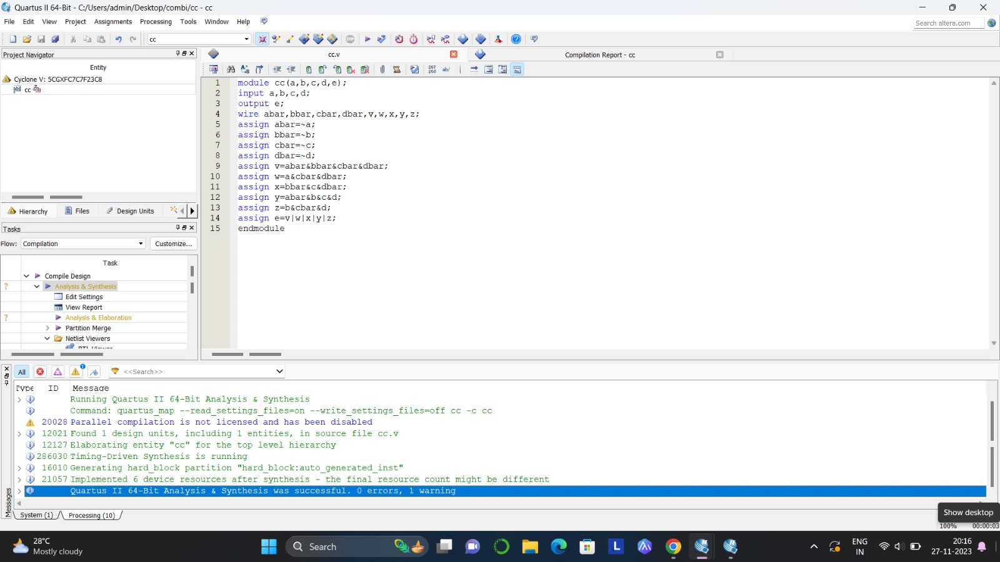
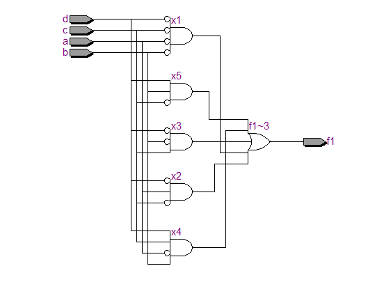
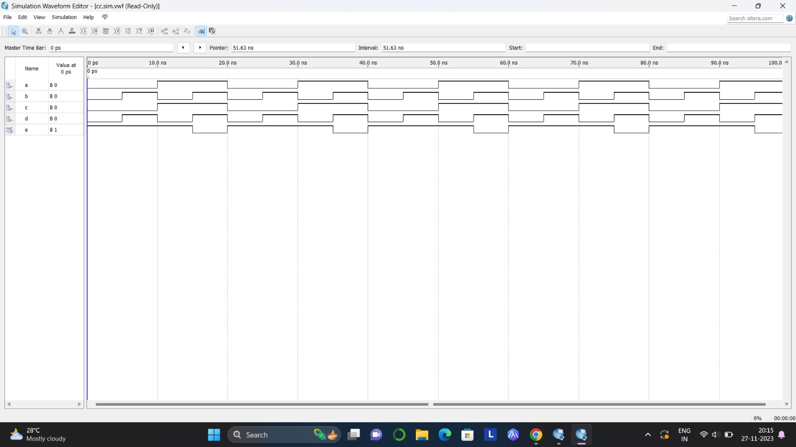
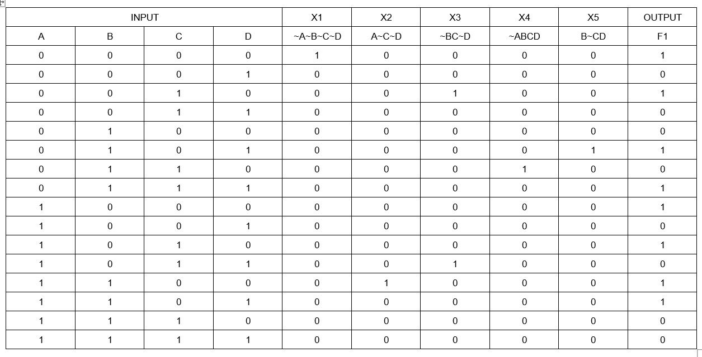

# Experiment--02-Implementation-of-combinational-logic
Implementation of combinational logic gates
 
## AIM:
To implement the given logic function verify its operation in Quartus using Verilog programming.
 F1= A’B’C’D’+AC’D’+B’CD’+A’BCD+BC’D
F2=xy’z+x’y’z+w’xy+wx’y+wxy
 
 
 
## Equipments Required:
## Hardware – PCs, Cyclone II , USB flasher
## Software – Quartus prime

## Procedure
1.Create a project with required entities. 2.Create a module along with respective file name. 3.Run the respective programs for the given boolean equations. 4.Run the module and get the respective RTL outputs. 5.Create university program(VWF) for getting timing diagram. 6.Give the respective inputs for timing diagram and obtain the result.
## Program:
```
/*
Program to implement the given logic function and to verify its operations in quartus using Verilog programming.
Developed by: SANTHIYA R
RegisterNumber:  23005263
*/
```


## RTL:


## Timing Diagram:


## Truth Table:


## Result:
Thus the given logic functions are implemented using  and their operations are verified using Verilog programming.
